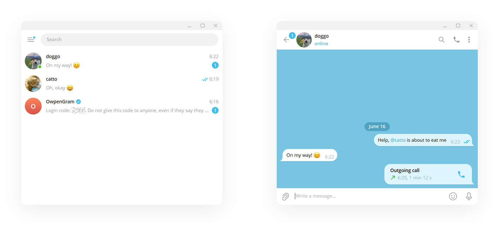
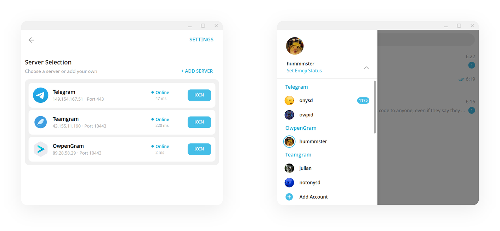

<p align="center">
  
</p>

# 💻 OwpenGram for Desktop

**One familiar app. Any server you trust.**

OwpenGram for Desktop is a multi-server messenger built on a fast, familiar
experience. Use the official network, your own private server, or any community
node — each account independent, all in one app. Private by design, comfortable
to use, and free from lock-in.

> 🪟 **Available now for Windows.** macOS and Linux builds are planned.

> 🔗 Built on **MTProto API layer 228**.

<p align="center">
  
</p>

---

## ✨ Why you'll like it

- 🌐 **Multi-server** — add accounts on different servers and switch between them freely.
- 🏠 **Bring your own server** — connect to a server you host and fully control.
- 🧠 **Familiar & comfortable** — the experience you already know, no learning curve.
- 🔒 **Private** — talk on infrastructure you trust, away from the cloud.
- 🛡️ **Censorship-resistant** — your own server stays reachable when others are blocked.
- 🆓 **Open source** — read it, audit it, build it yourself.

## 🌐 How multi-server works

Every account is tied to a server, and you choose that server when you sign in.
OwpenGram comes with ready-to-use options:

- **Telegram** — the official network (use your normal Telegram account)
- **OwpenGram** — the project's public server
- **Custom** — any server you or your community runs

Add several accounts on different servers and they stay cleanly separated —
different identities, different data, one app.

<p align="center">
  
</p>

## 🔌 Connect your own server

On the **server selection screen** (shown when you log in or add a new account),
click **➕ Add server** and fill in:

- **Name** — any label you like (e.g. *My Server*)
- **Host** — your server's IP or domain (e.g. `203.0.113.10` or `chat.example.com`)
- **Port** — `10443` (the default OwpenGram MTProto port)
- **Type** — choose **single-server** for a self-hosted server (pick **Multi-DC (Telegram)** only for true multi-datacenter networks)
- **Main data center** — leave as `2` (the default) for a self-hosted server
- **RSA key** — leave **empty** unless your server uses a custom key

Then save, select the server, and log in as usual.

> The default OwpenGram server key is already built in, so the RSA field stays
> blank in almost all cases. Only paste a PEM public key if the server operator
> replaced the server's key with their own.

Don't have a server yet? Spin one up in one command:
👉 [owpengram-server](https://github.com/owpengram/owpengram-server)

## 🛠️ Build (Windows)

Run the interactive build script — double-click it or run from a terminal:

```bat
build-windows.bat
```

It guides you through API credentials, submodules, `prepare`, `configure` and the
MSBuild step, and remembers your answers in `.owpengram-build.local.json`
(gitignored).

**Requirements:** Visual Studio 2022 (C++ x64), Python 3.10, Git. For manual
steps and other platforms, see `docs/building-win-x64.md` and the upstream
[Telegram Desktop](https://github.com/telegramdesktop/tdesktop) build docs.

## 🐧 Build (Linux)

Native build against system libraries (no Docker, no snap):

```bash
scripts/build-linux.sh            # Release (default)
scripts/build-linux.sh --debug    # Debug
```

It installs missing system dependencies (pacman), builds and installs `tde2e`
locally, initializes submodules, configures CMake in packaged mode, and builds
with `mold` if available. The resulting binary is at `out/OwpenGram`.

**Requirements:** Arch/Manjaro (pacman-based) or a distro with equivalent
packages, CMake, Ninja, Git.

## 📦 Part of the OwpenGram project

- 🚀 [Server](https://github.com/owpengram/owpengram-server)
- 🤖 [Android client](https://github.com/owpengram/owpengram-android-client)
- 🌐 [GitHub organization](https://github.com/owpengram)

## 💬 Community

- 📢 Channel: [@owpengram](https://t.me/owpengram)
- 💬 Chat: [Join the discussion](https://t.me/+sVB6Ymv70jEwNTAy)

## 📄 License

Based on [Telegram Desktop](https://github.com/telegramdesktop/tdesktop) —
**GPLv3 with the OpenSSL exception** ([LICENSE](LICENSE)).

### Third-party

* Qt 6 ([LGPL](http://doc.qt.io/qt-6/lgpl.html)) and Qt 5.15 ([LGPL](http://doc.qt.io/qt-5/lgpl.html)) slightly patched
* OpenSSL 3.2.1 ([Apache License 2.0](https://openssl-library.org/source/license/apache-license-2.0.txt))
* WebRTC ([New BSD License](https://github.com/desktop-app/tg_owt/blob/master/LICENSE))
* zlib ([zlib License](http://www.zlib.net/zlib_license.html))
* LZMA SDK 9.20 ([public domain](http://www.7-zip.org/sdk.html))
* liblzma ([public domain](http://tukaani.org/xz/))
* Google Breakpad ([License](https://chromium.googlesource.com/breakpad/breakpad/+/master/LICENSE))
* Google Crashpad ([Apache License 2.0](https://chromium.googlesource.com/crashpad/crashpad/+/master/LICENSE))
* GYP ([BSD License](https://github.com/bnoordhuis/gyp/blob/master/LICENSE))
* Ninja ([Apache License 2.0](https://github.com/ninja-build/ninja/blob/master/COPYING))
* OpenAL Soft ([LGPL](https://github.com/kcat/openal-soft/blob/master/COPYING))
* Opus codec ([BSD License](http://www.opus-codec.org/license/))
* FFmpeg ([LGPL](https://www.ffmpeg.org/legal.html))
* Guideline Support Library ([MIT License](https://github.com/Microsoft/GSL/blob/master/LICENSE))
* Range-v3 ([Boost License](https://github.com/ericniebler/range-v3/blob/master/LICENSE.txt))
* Open Sans font ([Apache License 2.0](http://www.apache.org/licenses/LICENSE-2.0.html))
* Vazirmatn font ([SIL Open Font License 1.1](https://github.com/rastikerdar/vazirmatn/blob/master/OFL.txt))
* Emoji alpha codes ([MIT License](https://github.com/emojione/emojione/blob/master/extras/alpha-codes/LICENSE.md))
* xxHash ([BSD License](https://github.com/Cyan4973/xxHash/blob/dev/LICENSE))
* QR Code generator ([MIT License](https://github.com/nayuki/QR-Code-generator#license))
* CMake ([New BSD License](https://github.com/Kitware/CMake/blob/master/Copyright.txt))
* Hunspell ([LGPL](https://github.com/hunspell/hunspell/blob/master/COPYING.LESSER))
* Ada ([Apache License 2.0](https://github.com/ada-url/ada/blob/main/LICENSE-APACHE))

---

⭐ If OwpenGram is useful to you, a star on GitHub helps a lot.
